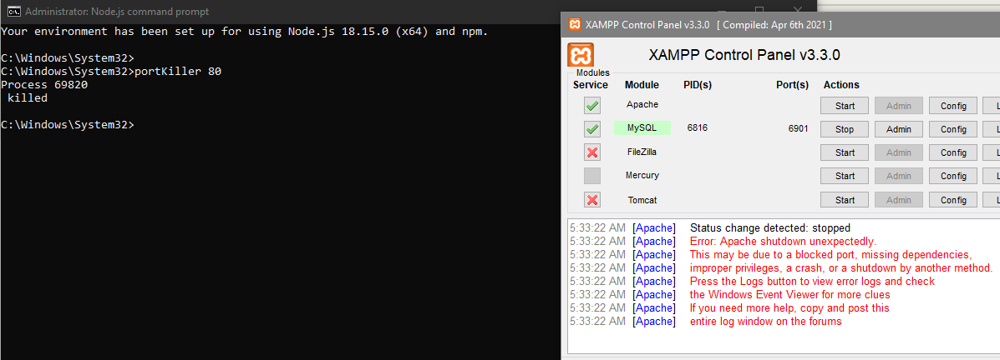

# simple port killer
using the command line to lookup and kill a process by port number

## prerequisites for building
- nodejs
- npm
- pkg (npm install -g pkg) is used to build the executable
- windows system

## Usage
```bash
npm install
```

```bash
pkg .
```

```
add the executable path to the environment variable path in windows
```

```bash
portkiller 8080
```

## Notes
- some process with specific port require admin privilege to kill  


when running as admin  

